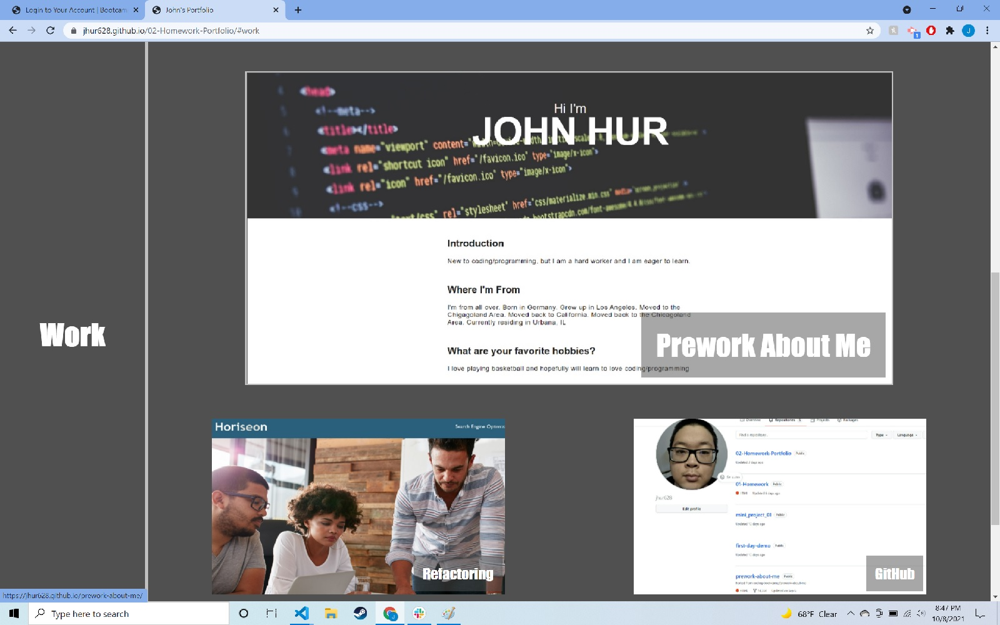

# 02-Homework-Portfolio

## Description

I worked on the portfolio section by section. I worked on a sections HTML, then worked on the CSS for that section to ensure the application is loading as I want it to.

The repository has been loaded as a website and the portfolio is able to be loaded and viewed.

The navigation links scroll to the appropriate section of the application.
When work is clicked, the website is scrolled to my "Work" section of my portfolio.

My first "Work" application is larger than the other two as it is my first application I worked on(being the prework).
When the images of the application are clicked on, a new tab of the application is opened, and the user is taken to the application.

I tested the application on different media screens(utilizing the "inspect" function on my browser and my smartphone), and display is changed to a column view for easy view while scrolling.

## Screenshot

## Links

Deployed Application: [https://jhur628.github.io/02-Homework-Portfolio/](https://jhur628.github.io/02-Homework-Portfolio/)

GitHub Repository: [https://github.com/jhur628/02-Homework-Portfolio](https://github.com/jhur628/02-Homework-Portfolio)

## Other Comments

This project helped me to realize that it's okay to feel uncomfortable. I was eventually able to figure things out. Sometimes, I used Google. Sometimes, I just needed a break. I am excited to move forward in this boot camp and continue to learn from this uncomfortable feeling. I'm also getting more comfortable pulling and pushing repositories.